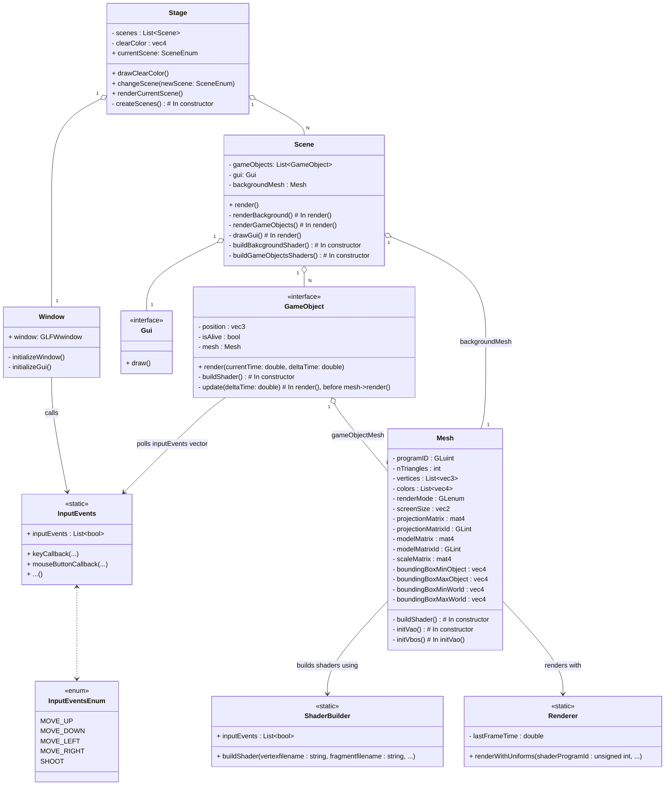

```mermaid
classDiagram
direction TB

class Window {
	+ window: GLFWwindow

	- initializeWindow()
	- initializeGui()
}

class InputEvents {
<<static>>
	+ inputEvents : List~bool~

	+ keyCallback(...)
	%%(window: GLFWwindow, key: int, scancode: int, action: int, mods: int)
	+ mouseButtonCallback(...)
	%%(window: GLFWwindow, button: int, action: int, mods: int)
	+ ...()
}

class Stage {
	- scenes : List~Scene~
	- clearColor : vec4

	+ currentScene: SceneEnum
	+ drawClearColor()
	+ changeScene(newScene: SceneEnum)
	+ renderCurrentScene()

	- createScenes() # In constructor
}

class Scene {
	- gameObjects: List~GameObject~
	- gui: Gui
	- backgroundMesh : Mesh

	+ render()

	- renderBackground() # In render()
	- renderGameObjects() # In render()
	- drawGui() # In render()

	- buildBakcgroundShader() # In constructor
	- buildGameObjectsShaders() # In constructor
}

class Gui {
	<<interface>>
	+ draw()
}

class GameObject {
	<<interface>>
	- position : vec3
	- isAlive : bool
	- mesh : Mesh

	+ render(currentTime: double, deltaTime: double)
	- buildShader() # In constructor
	- update(deltaTime: double) # In render(), before mesh->render()
}

class Mesh {
	- programID : GLuint
	- nTriangles : int
	- vertices : List~vec3~
	- colors : List~vec4~
	- renderMode : GLenum
	- screenSize : vec2

	- projectionMatrix : mat4
	- projectionMatrixId : GLint
	- modelMatrix : mat4
	- modelMatrixId : GLint
	- scaleMatrix : mat4

	%% - timeElapsedId : GLint
	%% - resolutionId : GLint

	- boundingBoxMinObject : vec4
	- boundingBoxMaxObject : vec4
	- boundingBoxMinWorld : vec4
	- boundingBoxMaxWorld : vec4

	- buildShader() # In constructor
	- initVao() # In constructor
	- initVbos() # In initVao()
}

class InputEventsEnum {
	<<enum>>
	MOVE_UP
	MOVE_DOWN
	MOVE_LEFT
	MOVE_RIGHT
	SHOOT
}

class ShaderBuilder {
	<<static>>
	+ buildShader(vertexfilename : string, fragmentfilename : string, ...)
	%%(vertexfilename : string, fragmentfilename : string, shouldPrintLogs : bool) GLuint

	+ inputEvents : List~bool~
}

class Renderer {
<<static>>
	- lastFrameTime : double

	+ renderWithUniforms(shaderProgramId : unsigned int, ...)
	%% (shaderProgramId : unsigned int, projectionMatrix : mat4, modelMatrix : mat4, currentTime : float, resolution: vec2)
}

%% MainMenuScene ..> Scene : instance
%% MainMenuScene "1" o-- "1" MainMenuGui
%% GameScene ..> Scene : instance
%% MainMenuGui --|> Gui
%% GameGui --|> Gui
%% GameScene "1" o-- "1" GameGui

Stage "1" o-- "1" Window
Stage "1" o-- "N" Scene
Scene "1" o-- "1" Gui
Scene "1" o-- "N" GameObject
GameObject "1" o-- "1" Mesh : gameObjectMesh
Scene "1" o-- "1" Mesh : backgroundMesh
Mesh --> ShaderBuilder : builds shaders using

Window --> InputEvents : calls
GameObject --> InputEvents : polls inputEvents vector

Mesh --> Renderer : renders with

InputEvents <..> InputEventsEnum
```