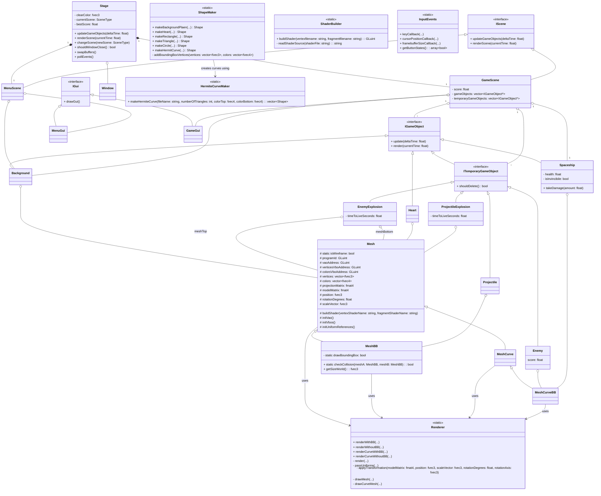

```mermaid
classDiagram
direction TB

class Stage {
	- clearColor: fvec3
	- currentScene: SceneType
	- bestScore: float
	+ updateGameObjects(deltaTime: float)
	+ renderScene(currentTime: float)
	+ changeScene(newScene: SceneType)

	+ shouldWindowClose() bool
	+ swapBuffers()
	+ pollEvents()
}
Stage "1" *-- "1" MenuScene
Stage "1" *-- "1" GameScene
Stage o-- Window
class Window

class Mesh {
	# static isWireframe: bool

	# programId: GLuint
	# vaoAddress: GLuint
	# verticesVboAddress: GLuint
	# colorsVboAddress: GLuint
	# vertices: vector~fvec3~
	# colors: vector~fvec4~
	# projectionMatrix: fmat4
	# modelMatrix: fmat4
	# position: fvec3
	# rotationDegrees: float
	# scaleVector: fvec3

	# buildShader(vertexShaderName: string, fragmentShaderName: string)
	# initVao()
	# initVbos()
	# initUniformReferences()
}
class MeshBB {
	- static drawBoundingBox: bool
	+ static checkCollision(meshA: MeshBB, meshB: MeshBB): bool
	+ getSizeWorld(): fvec3
}
class MeshCurve
class MeshCurveBB
Mesh <|-- MeshBB
Mesh <|-- MeshCurve
MeshCurve <|-- MeshCurveBB
Mesh --> Renderer: uses
MeshBB --> Renderer: uses
MeshCurve --> Renderer: uses
MeshCurveBB --> Renderer: uses

class Renderer { <<static>>
	+ renderWithBB(...)
	+ renderWithoutBB(...)
	+ renderCurveWithBB(...)
	+ renderCurveWithoutBB(...)
	- render(...)
	- passUniforms(...)
	- applyTransformation(modelMatrix: fmat4, position: fvec3, scaleVector: fvec3, rotationDegrees: float, rotationAxis: fvec3)
	- drawMesh(...)
	- drawCurveMesh(...)
}
class ShapeMaker { <<static>>
	+ makeBackgroundPlaen(...) Shape
	+ makeHeart(...) Shape
	+ makeRectangle(...) Shape
	+ makeTriangle(...) Shape
	+ makeCircle(...) Shape
	+ makeHermitCurve(...) Shape
	- addBoundingBoxVertices(vertices: vector~fvec3~, colors: vector~fvec4~)
}
ShapeMaker --> HermiteCurveMaker: creates curves using
class HermiteCurveMaker { <<static>>
	+ makeHermiteCurve(fileName: string, numberOfTriangles: int, colorTop: fvec4, colorBottom: fvec4): vector~Shape~
}
class ShaderBuilder { <<static>>
	+ buildShader(vertexfilename: string, fragmentfilename: string): GLuint
	- readShaderSource(shaderFile: string): string
}
class InputEvents { <<static>>
	+ keyCallback(...)
	+ cursorPositionCallback(...)
	+ framebufferSizeCallback(...)
	+ getButtonStates(): array~bool~
}

%% Game Objects
class IGameObject{ <<interface>>
	+ update(deltaTime: float)
	+ render(currentTime: float)
}
class Background
class Enemy {
	score: float
}
class Heart
class Projectile
class Spaceship {
	- health: float
	- isInvincibile: bool
	+ takeDamage(amount: float)
}
class ITemporaryGameObject{ <<interface>>
	+ shouldDelete() bool
}
class EnemyExplosion {
	- timeToLiveSeconds: float
}
class ProjectileExplosion {
	- timeToLiveSeconds: float
}

IGameObject <|-- Background
IGameObject <|-- Heart
IGameObject <|-- Spaceship
IGameObject <|-- ITemporaryGameObject
ITemporaryGameObject <|-- Projectile
ITemporaryGameObject <|-- Enemy
ITemporaryGameObject <|-- EnemyExplosion
ITemporaryGameObject <|-- ProjectileExplosion

Background o-- Mesh
Enemy o-- MeshCurveBB
%% Enemy <-- Parameters: uses parameters from
EnemyExplosion o-- Mesh: meshTop
EnemyExplosion o-- Mesh: meshBottom
Heart o-- Mesh
Projectile o-- MeshBB
ProjectileExplosion o-- Mesh
Spaceship o-- MeshCurveBB

%% Gui
class IGui { <<interface>>
	+ drawGui()
}
class MenuGui
class GameGui
IGui <|-- MenuGui
IGui <|-- GameGui

%% Scenes
class IScene { <<interface>>
	+ updateGameObjects(deltaTime: float)
	+ renderScene(currentTime: float)
}
class MenuScene
class GameScene {
	- score: float
	- gameObjects: vector~IGameObject*~
	- temporaryGameObjects: vector~IGameObject*~
}
IScene <|-- MenuScene
IScene <|-- GameScene
GameScene "1" o-- "*" IGameObject
GameScene "1" o-- "*" ITemporaryGameObject
GameScene "1" o-- "1" Spaceship

MenuScene o-- Background
MenuScene o-- MenuGui
GameScene o-- Background
GameScene o-- GameGui

```